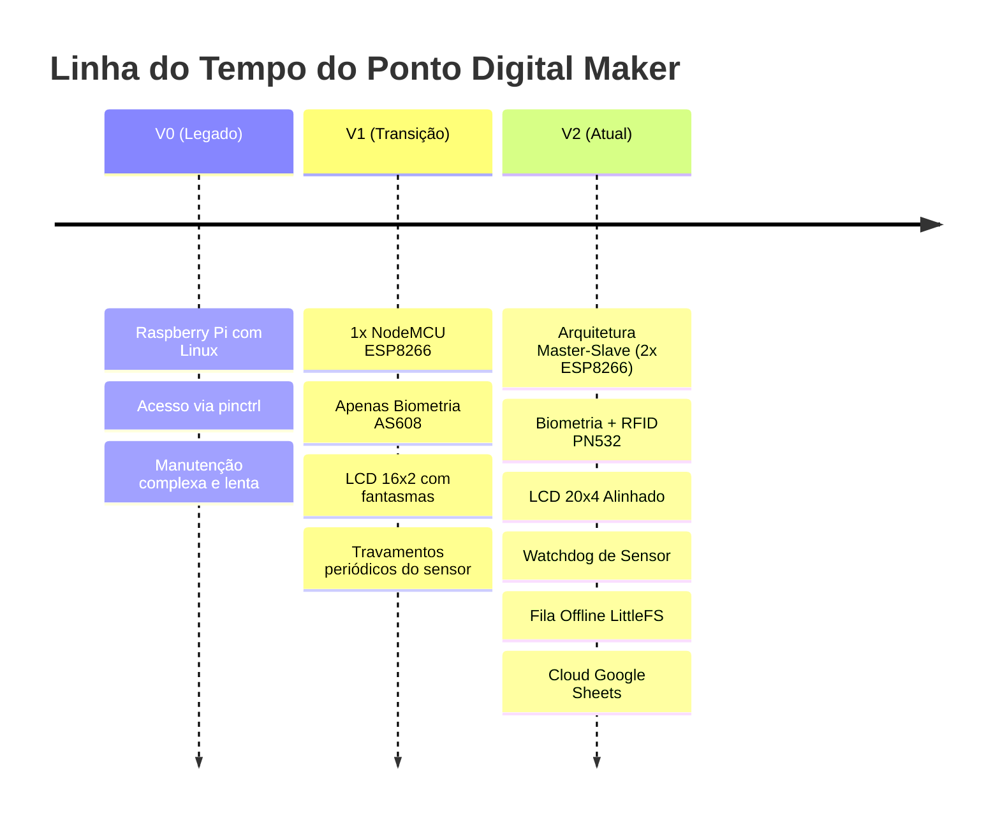

# ⏱️ Ponto Digital Maker (Versão 2.0)
### Sistema Híbrido de Ponto Eletrônico e Gestão de Escalas (Biometria + RFID)
**[MakerSpace UNIFEI](https://www.instagram.com/makerspaceunifei/) — Universidade Federal de Itajubá**


---

## 📌 1. Sobre o Projeto e Motivação

No **MakerSpace UNIFEI**, os membros da equipe possuem uma carga horária obrigatória de **4 horas semanais**, cumpridas através de **escalas fixas de 1h50 (duas vezes por semana)**. 

O **Ponto Digital Maker** foi desenvolvido com o propósito específico de **auditar e registrar se os integrantes estão cumprindo corretamente as suas escalas de trabalho**.

> [!NOTE]
> **Esclarecimento de Escopo:** O sistema **não é um controle de acesso físico** (não aciona travas de portas ou catracas). O seu propósito é exclusivamente gerencial e operacional para controle de presença. Líderes de área e determinadas exceções não precisam bater ponto, mesmo que estejam presentes nos cadastros do banco.

---

## 🏛️ Sobre o MakerSpace UNIFEI

O **MakerSpace UNIFEI** é um laboratório acadêmico e profissional de fabricação digital aberto à comunidade universitária e ao ecossistema externo de inovação:
* **Capacidades do Laboratório:** Impressão 3D (tecnologias FDM em PLA/ABS e estereolitografia em Resina), corte e gravação a laser, usinagem CNC e bancadas completas para prototipagem eletrônica rápida.
* **Atuação:** Atendimento a demandas de projetos internos e clientes externos (do orçamento, modelagem e fabricação até a entrega final), desenvolvendo produtos eletrônicos baseados em Arduino, ESP32, ESP8266, Raspberry Pi, sensores e atuadores industriais.
* **Redes Oficiais:**
  * 📸 Instagram: [@makerspaceunifei](https://www.instagram.com/makerspaceunifei/)
  * 💼 LinkedIn: [Maker UNIFEI](https://www.linkedin.com/company/maker-unifei/)

Todo o hardware utilizado neste projeto pertence ao patrimônio do **MakerSpace UNIFEI** e está atualmente em operação ativa na entrada da oficina para uso comum de toda a equipe.

---

## 📜 Histórico de Engenharia: A Evolução (V0 ➔ V1 ➔ V2)



### 🔹 V0 — A Prova de Conceito Inicial (Raspberry Pi)
* O protótipo primitivo era executado sobre um computador de placa única **Raspberry Pi** rodando Linux.
* As interfaces de hardware eram manipuladas via utilitários do sistema como `pinctrl` e scripts de automação.
* **Limitações:** Manutenção difícil e pesada para um dispositivo de bancada que precisava ficar ligado 24/7; tempo de inicialização lento em quedas de energia e suscetibilidade à corrupção de cartão SD.

### 🔹 V1 — A Migração para Microcontrolador (Monolítico)
* Desenvolvida por membros anteriores da equipe, migrou o sistema para um microcontrolador dedicado: **1x NodeMCU ESP8266**.
* Contava apenas com o sensor biométrico AS608 e display LCD.
* **Problemas Críticos Identificados:**
  * **Congelamento do Leitor Óptico:** O sensor AS608 travava a cada poucas horas de uso contínuo, exigindo que alguém puxasse o cabo da tomada para reiniciar fisicamente a placa.
  * **Display LCD Desconfigurado:** O display físico era um **20x4**, mas o firmware estava configurado para **16x2**, cortando mensagens pela metade e gerando caracteres "fantasmas" sobrepostos.
  * **Leitura Biométrica Lenta:** Ausência de feedback de processamento e lentidão em laços seriais bloqueantes (`while(!Serial.available())`).
  * **Falta de Feedback Sensorial:** Sem avisos sonoros ou luminosos, o usuário ficava na dúvida se o ponto havia sido computado.

### 🔹 V2 — A Versão Definitiva de Engenharia (Atual)
Desenvolvida por **Victor Augusto** (membro da Área de Projetos do MakerSpace), a **Versão 2.0** consistiu em uma reformulação arquitetural e de código completa:
1. **Watchdog Preventivo do Sensor Biométrico:** Algoritmo que monitora falhas de comunicação com o AS608. Ao detectar anomalias ou a cada 2 horas preventivas, envia uma sequência binária de soft-reset direto para o DSP do sensor via UART, restaurando a leitura sem reiniciar o microcontrolador.
2. **Engenharia de Texto no LCD 20x4:** Redesenho completo do driver de texto com funções matemáticas de centralização geométrica (`formatarCentro`), preenchimento de buffer (`formatarLinha`) e exibição de relógio em tempo real via NTP com precisão de segundos.
3. **Identificação Híbrida com NFC/RFID (PN532 V3 SPI):** Implementação de leitor de cartões e chaveiros Mifare (13.56 MHz) em barramento SPI de alta velocidade, permitindo batidas de ponto instantâneas.
4. **Interface Audiovisual Completa:**
   * **Buzzer:** Tons sonoros exclusivos para Inicialização, Entrada (2 bips curtos), Saída (1 bip médio) e Acesso Negado (1 bip longo).
   * **LED RGB Difuso:** Pulso azul suave em repouso (*breathing*), verde duplo na entrada, verde longo na saída e vermelho em caso de erro ou cartão não cadastrado.
5. **Arquitetura Distribuída Master-Slave (2 Placas):**
   * *O problema inicial:* O ESP8266 possui apenas cerca de 9 pinos GPIO úteis. Ao somar os pinos necessários para o display I2C (2), sensor biométrico UART (2), leitor RFID SPI (4), LED RGB (3), Buzzer (1) e botão de cadastro (1), a conta resultou em **13 pinos necessários**.
   * *A solução de projeto:* Divisão do sistema em dois microcontroladores interligados via barramento serial ponto a ponto assíncrono (UART 9600 baud com controle de fluxo por software e mensagens `CARD:UID`, `OK_E`, `OK_S`, `DENIED`, `ACK`).
6. **Tolerância a Quedas de Rede (LittleFS Offline Queue):** Se a rede Wi-Fi cair, as batidas são gravadas no arquivo `/pendentes.txt` da memória flash SPIFFS/LittleFS e reenviadas de forma transparente assim que o sinal for restabelecido.
7. **Fechamento Automático de Turno (23:00h):** Rotina diária que verifica quem esqueceu o ponto em aberto e encerra o turno automaticamente na planilha, mantendo a folha de presença íntegra.

---

## ⚡ Visão da Arquitetura Distribuída (Master-Slave)

```mermaid
flowchart TD
    subgraph SlaveNode ["NodeMCU #2 (Slave - Periféricos)"]
        PN532["Módulo NFC/RFID PN532 (SPI)"] -->|Leitura UID| ESP_SLAVE["ESP8266 Slave"]
        ESP_SLAVE -->|Chaveamento| RGB["LED RGB (Catodo Comum)"]
    end

    subgraph MasterNode ["NodeMCU #1 (Master - Cérebro Central)"]
        ESP_MASTER["ESP8266 Master"]
        AS608["Sensor Biométrico AS608 (UART 57600)"] <--> ESP_MASTER
        ESP_MASTER -->|I2C| LCD["Display LCD 20x4"]
        ESP_MASTER -->|GPIO15| BUZZER["Buzzer Sonoro"]
        ESP_MASTER -->|Flash FS| LFS["LittleFS (Banco Local)"]
    end

    ESP_SLAVE <==>|UART 9600 baud (Handshake / ACK)| ESP_MASTER
    ESP_MASTER -->|HTTPS REST| CLOUD["Google Sheets WebApp"]
```

---

## 📂 Estrutura de Arquivos do Repositório

```text
/home/vaugusto/Desktop/Ponto_Digital_Maker/
├── README.md                          # Documentação executiva e guia rápido
├── LICENSE                            # Licença de código aberto MIT
├── .gitignore                         # Filtro de compilação e artefatos
├── docs/
│   ├── ESPECIFICACAO_TECNICA.md       # Diagrama elétrico, strapping pins e cálculos de resistores
│   ├── MANUAL_DO_SISTEMA.md           # Guia de operação, menu serial, LittleFS e fechamento
│   └── RELATORIO_EVOLUCAO_V1_V2.md    # Análise profunda de engenharia V1 vs V2
├── firmware/
│   ├── ponto/
│   │   └── ponto.ino                  # Firmware do Mestre (Biometria, LCD, WiFi, LittleFS, Nuvem)
│   └── slave_rfid/
│       └── slave_rfid.ino             # Firmware do Escravo (PN532 SPI, LED RGB, Protocolo UART)
├── cloud/
│   ├── google_apps_script.js          # Backend Google Apps Script (Webhook para Google Sheets)
│   └── README.md                      # Tutorial de implantação da planilha na nuvem
└── backup/
    └── backup_pessoas.txt             # Template em texto para injeção de fábrica no LittleFS
```

---

## 🚀 Guia Rápido de Instalação e Uso

### 1. Bibliotecas Necessárias (Arduino IDE)
Instale pelo **Library Manager** da Arduino IDE:
* `Adafruit Fingerprint Sensor Library` (para o AS608)
* `LiquidCrystal I2C` (por Frank de Brabander ou Marco Schwartz)
* `Adafruit PN532` (para o leitor RFID da Slave)

### 2. Configurações da IDE (Placa NodeMCU 1.0 ESP-12E)
* **Placa:** `NodeMCU 1.0 (ESP-12E Module)`
* **CPU Frequency:** `80 MHz` (ou `160 MHz`)
* **Flash Size:** `4MB (FS:2MB OTA:~1019KB)`
* ⚠️ **Erase Flash:** **`Only Sketch`** *(essencial para não formatar a partição de banco do LittleFS)*

### 3. Passo a Passo de Gravação e Setup
1. **Configurar a Nuvem:**
   * Siga o guia em [`cloud/README.md`](cloud/README.md) para publicar o Google Apps Script e obter o link do WebApp.
2. **Gravar a Placa SLAVE:**
   * Desconecte os pinos `TX` e `RX` da Slave antes de conectar ao cabo micro-USB (evita colisões com o chip serial USB).
   * Abra [`firmware/slave_rfid/slave_rfid.ino`](firmware/slave_rfid/slave_rfid.ino) e realize o upload.
   * Reconecte os fios de comunicação serial interplacas.
3. **Configurar e Gravar a Placa MASTER:**
   * Abra [`firmware/ponto/ponto.ino`](firmware/ponto/ponto.ino) e preencha as credenciais no topo:
     ```cpp
     const char* WIFI_SSID     = "SUA_REDE_WIFI";
     const char* WIFI_PASSWORD = "SUA_SENHA_WIFI";
     const char* WEBAPP_URL    = "https://script.google.com/macros/s/SEU_SCRIPT_ID/exec";
     ```
   * Grave na placa Master via USB.
   * Abra o Monitor Serial a **9600 baud**. Pressione **`B`** para inicializar a tabela de membros e os arquivos base no LittleFS.

---

## 🛠️ Menu Administrativo Serial (Via PC)

Basta conectar o cabo micro-USB da Master no computador e abrir um terminal a **9600 baud**:

```text
--- MENU ADMINISTRATIVO ---
1 - CADASTRAR nova pessoa (ID automatico)
2 - RECADASTRAR digital de alguem (mesma pessoa, nova digital)
3 - APAGAR UMA digital especifica
4 - APAGAR TODAS as digitais
5 - LISTAR digitais cadastradas
6 - LISTAR arquivo de nomes (bruto)
7 - EDITAR/CORRIGIR nome de um ID
8 - VER/REENVIAR pendentes agora
9 - CADASTRAR/ASSOCIAR cartao RFID a um ID
A - LISTAR cartoes RFID cadastrados
B - RESTAURAR nomes de backup (Integrantes)
```
*(Todas as telas contam com timeout de 60 segundos de inatividade para evitar travamentos).*

---

## 👨‍💻 Autoria e Créditos

* **Desenvolvimento da V2.0:** [Victor Augusto](https://github.com/victor-silverio) — Membro da Área de Projetos do **MakerSpace UNIFEI**.
* **Versões Anteriores (V0 / V1):** Membros precursores do projeto MakerSpace UNIFEI.
* **Propriedade do Hardware:** [MakerSpace UNIFEI](https://www.instagram.com/makerspaceunifei/) — Universidade Federal de Itajubá.

---

## 📄 Licença

Este projeto é distribuído sob a licença **MIT**. Consulte o arquivo [LICENSE](LICENSE) para mais detalhes.
