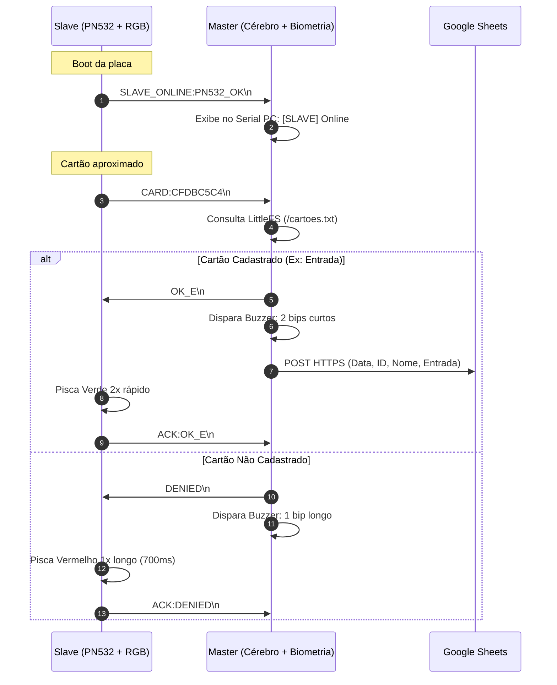

# Especificação Técnica de Engenharia
### Ponto Digital Maker (V2.0) — Sistema Master-Slave
**MakerSpace UNIFEI**

---

## 1. Lista de Componentes (Bill of Materials - BOM)

| Item | Componente | Quantidade | Descrição / Especificação |
|:---:|---|:---:|---|
| 1 | **NodeMCU v3 (ESP-12E)** | 2 | Microcontrolador Wi-Fi ESP8266, 4MB Flash |
| 2 | **Sensor Biométrico AS608** | 1 | Sensor óptico de digitais, comunicação UART (57600 baud), 3.3V |
| 3 | **Módulo NFC/RFID PN532 V3** | 1 | Leitor 13.56 MHz (Mifare / ISO14443A), configurado em SPI |
| 4 | **Display LCD 20x4 I2C** | 1 | Controlador HD44780 com interface PCF8574T no endereço `0x27` |
| 5 | **LED RGB Difuso** | 1 | Catodo Comum (4 pinos: R, GND, G, B) |
| 6 | **Buzzer** | 1 | 5V / 3.3V ativo/passivo acionado via pino digital |
| 7 | **Resistor 220 Ω (1/4W)** | 2 | Limitadores de corrente para os canais R e G do LED RGB |
| 8 | **Resistor 47 Ω (1/4W)** | 1 | Limitador de corrente para o canal B do LED RGB |
| 9 | **Resistor 10 kΩ (1/4W)** | 1 | Resistor de *pull-down* de segurança para strapping pin (GPIO15) |
| 10 | **Jumpers & Protoboard** | — | Fiação de interconexão e montagem |

---

## 2. Mapa Elétrico de Pinagens e Conexões

### 2.1. Placa MASTER (NodeMCU #1 — Processador Central)
A placa Master gerencia a interface com o usuário, a biometria, o visor LCD, a conexão de rede e a persistência de dados.

| Pino Master | GPIO | Função de Hardware | Conectado a | Observações Elétricas |
|:---:|:---:|---|---|---|
| **D0** | GPIO16 | SoftwareSerial TX | **Slave RX (GPIO3)** | Saída digital livre de restrições de strapping |
| **D1** | GPIO5 | I2C SCL | **LCD 20x4 (SCL)** | Linha de clock I2C com pull-up do módulo |
| **D2** | GPIO4 | I2C SDA | **LCD 20x4 (SDA)** | Linha de dados I2C com pull-up do módulo |
| **D3** | GPIO0 | Botão FLASH | **Botão Onboard / GND** | Entrada de cadastro rápido sem PC (pull-up ativo) |
| **D4** | GPIO2 | LED_BUILTIN | LED Azul Onboard | Indicador de leitura e pulso interno |
| **D5** | GPIO14 | SoftwareSerial RX | **AS608 TX (Verde)** | Recepção serial a 57600 baud |
| **D6** | GPIO12 | SoftwareSerial TX | **AS608 RX (Branco)** | Transmissão serial a 57600 baud |
| **D7** | GPIO13 | SoftwareSerial RX | **Slave TX (GPIO1)** | Recepção de dados RFID da Slave (9600 baud) |
| **D8** | GPIO15 | Saída Digital | **Buzzer (+)** | Pino de boot: aterrado pelo buzzer (0V no boot) |
| **3V3** | — | Alimentação 3.3V | **AS608 VCC (Vermelho)** | **OBRIGATÓRIO 3.3V** (5V queima o sensor óptico) |
| **VV / VIN** | — | Barramento 5V USB | **LCD VCC**, **Slave VIN** | Fornece 5V direto da porta USB |
| **GND** | — | Referência Comum | **Todos os GNDs** | Terra unificado obrigatório |

---

### 2.2. Placa SLAVE (NodeMCU #2 — Coprocessador RFID & RGB)
A placa Slave opera dedicada à leitura de alta frequência da antena RFID e controle do LED RGB de feedback.

| Pino Slave | GPIO | Função de Hardware | Conectado a | Observações Elétricas |
|:---:|:---:|---|---|---|
| **TX** | GPIO1 | Hardware UART TX | **Master D7 (GPIO13)** | Envia eventos `CARD:UID` e `ACK` (9600 baud) |
| **RX** | GPIO3 | Hardware UART RX | **Master D0 (GPIO16)** | Recebe autorizações `OK_E`, `OK_S`, `DENIED` |
| **D0** | GPIO16 | Saída Digital | **LED Verde [220Ω]** | Sem pull-up interno: permanece desligado no boot |
| **D1** | GPIO5 | Saída Digital | **LED Azul [47Ω]** | Linha sem strapping, chaveamento limpo |
| **D2** | GPIO4 | SPI CS (Chip Select) | **PN532 SS / SSEL** | Seleciona o periférico SPI no barramento |
| **D5** | GPIO14 | Hardware SPI SCK | **PN532 SCK** | Clock do barramento SPI |
| **D6** | GPIO12 | Hardware SPI MISO | **PN532 MISO (MI)** | Dados do leitor para a Slave |
| **D7** | GPIO13 | Hardware SPI MOSI | **PN532 MOSI (MO)** | Dados da Slave para o leitor |
| **D8** | GPIO15 | Saída Digital | **LED Vermelho [220Ω]** | Strapping Pin: acompanhado de resistor 10kΩ p/ GND |
| **VIN / VV**| — | Entrada 5V | **Master VV (5V)** | Alimentada pela Master via barramento comum |
| **GND** | — | Referência Comum | **Master GND**, **LED (-)** | Terra compartilhado |

---

### 2.3. Módulo RFID PN532 V3 (Configuração das Chaves DIP)
O módulo PN532 conta com duas microchaves seletoras de protocolo físico:

| Chave | Posição | Função |
|:---:|:---:|---|
| **SW1 (ou CH1)** | **OFF (0)** | Modo SPI Nativo |
| **SW2 (ou CH2)** | **OFF (0)** | Modo SPI Nativo |

> [!IMPORTANT]
> O pino **VCC do PN532** deve ser conectado à linha de **5V (VIN / VV)**. A alimentação em 3.3V enfraquece o campo magnético da antena e resulta em falhas intermitentes de leitura e erro de inicialização de firmware (`getFirmwareVersion() == 0`).

---

## 3. Engenharia de Strapping Pins e Cálculo de Resistores

O microcontrolador ESP8266 possui pinos de inicialização sensíveis (*strapping pins*) que determinam o modo de boot do processador. O dimensionamento elétrico da V2 foi planejado para eliminar travamentos e assegurar inicialização limpa:

### 3.1. Resolução do Conflito do GPIO15 (D8 na Master)
* **Regra do ESP8266:** Durante o boot (reset/power-on), o pino **GPIO15 precisa estar obrigatoriamente em nível lógico BAIXO (0V / GND)** para que o chip inicie a execução a partir da memória Flash interna SPI. Se estiver em nível ALTO (3.3V), o ESP entra em modo de boot por cartão SD/UART e trava.
* **Problema na V1/Tentativa Inicial:** Ao ligar o pino D8 da Master na linha de recepção (RX) da Slave, o resistor de pull-up interno da porta serial da Slave puxava o D8 da Master para 3.3V no momento em que ela ligava, impedindo o boot.
* **Solução Implementada:**
  1. A transmissão serial foi transferida para o pino **D0 (GPIO16)** da Master, que é um pino comum sem restrições de inicialização.
  2. O pino **D8 (GPIO15)** da Master passou a controlar o **Buzzer (+)**. Como o terminal negativo do buzzer vai para o GND, a bobina/circuito do buzzer funciona como um aterramento natural do pino GPIO15 no momento do boot, garantindo que o ESP8266 sempre inicie em nível BAIXO (0V).

### 3.2. Resolução do LED Verde na Slave (GPIO0 vs GPIO16)
* O pino **D3 (GPIO0)** possui um resistor de *pull-up* interno permanente na placa NodeMCU (usado para o botão FLASH). Ao ligar o anodo do LED Verde no D3, o LED ficava permanentemente aceso, mesmo com o código desligado.
* **Solução:** O LED Verde foi transferido para o pino **D0 (GPIO16)** da Slave, que não possui pull-up interno e permanece em 0V (desligado) até ser explicitamente acionado pelo firmware.

### 3.3. Cálculo de Corrente dos Canais do LED RGB
O ESP8266 opera em nível lógico de **3.3V**, com limite recomendado de corrente contínua de **12 mA por pino**:
$$R = \frac{V_{CC} - V_F}{I}$$

* **Canal Vermelho ($V_F \approx 2.0\text{ V}$):**
  $$R_R = \frac{3.3\text{ V} - 2.0\text{ V}}{0.006\text{ A}} \approx 216\ \Omega \implies \mathbf{220\ \Omega} \quad (I \approx 5.9\text{ mA})$$
* **Canal Verde ($V_F \approx 2.1\text{ V}$):**
  $$R_G = \frac{3.3\text{ V} - 2.1\text{ V}}{0.0055\text{ A}} \approx 218\ \Omega \implies \mathbf{220\ \Omega} \quad (I \approx 5.5\text{ mA})$$
* **Canal Azul ($V_F \approx 3.0\text{ V}$):**
  Devido à tensão de condução alta do diodo azul, um resistor de 220 Ω tornaria o brilho imperceptível sob 3.3V.
  $$R_B = \frac{3.3\text{ V} - 3.0\text{ V}}{0.0064\text{ A}} \approx 46.8\ \Omega \implies \mathbf{47\ \Omega} \quad (I \approx 6.4\text{ mA})$$
  *(O resistor de 10 Ω foi evitado por elevar a corrente para 30 mA, o que degradaria a saída do GPIO).*

---

## 4. Especificação do Protocolo de Comunicação Serial (Master ⮀ Slave)

A comunicação é realizada via UART em **9600 baud, 8 bits de dados, sem paridade, 1 stop bit (8N1)**:

### Quadro de Comandos do Protocolo

| Direção | Mensagem | Significado | Ação Disparada |
|---|---|---|---|
| **Slave ➔ Master** | `SLAVE_ONLINE:PN532_OK` | Slave pronta e leitor inicializado | Master registra no monitor serial |
| **Slave ➔ Master** | `CARD:<HEX_UID>` | Tag RFID detectada na antena | Master valida banco e processa turno |
| **Master ➔ Slave** | `OK_E` | Ponto reconhecido como ENTRADA | Slave executa sinal visual de entrada |
| **Master ➔ Slave** | `OK_S` | Ponto reconhecido como SAÍDA | Slave executa sinal visual de saída |
| **Master ➔ Slave** | `OK` | Resposta genérica / cadastro | Slave executa pisca verde curto |
| **Master ➔ Slave** | `DENIED` | Cartão não vinculado a nenhum ID | Slave executa alerta vermelho |
| **Slave ➔ Master** | `ACK:<CMD>` | Confirmação de recebimento | Master imprime no terminal de auditoria |

---

## 5. Máquina de Estados Audiovisual

| Estado do Sistema | Indicador LED RGB (Slave) | Indicador Buzzer (Master) | Mensagem no Display LCD 20x4 |
|---|---|---|---|
| **Inicialização / Boot** | Azul fixo | Silencioso | *"Inicializando... MakerSpace UNIFEI"* |
| **Sistema Pronto (Sucesso)** | Azul pisca 3 vezes | 3 bips rápidos (70ms) | *"Sistema Pronto! Biometria: OK"* |
| **Repouso / Aguardando** | **Azul suave pulsando** | Silencioso | Data/Hora, *"PONTO ELETRONICO"*, Status WiFi |
| **Tag Detectada na Antena** | Branco rápido (60ms) | Silencioso | Mantém tela ou prepara resposta |
| **Validação: ENTRADA** | **Verde pisca 2x rápido** | **2 bips curtos (100ms)** | Nome da Pessoa + *">>> ENTRADA <<<"* |
| **Validação: SAÍDA** | **Verde pisca 1x lento (350ms)** | **1 bip médio (220ms)** | Nome da Pessoa + *">>> SAIDA <<<"* |
| **Acesso Negado (Não cadastrado)**| **Vermelho longo (700ms)** | **1 bip longo (700ms)** | *"ACESSO NEGADO! Cartao/Digital nao cadast."* |
| **Erro Crítico no Leitor PN532**| **Vermelho piscando infinito**| Silencioso | Slave entra em loop de segurança |
| **Watchdog: Reset de Sensor** | Mantém estado atual | Silencioso | *"Reiniciando sensor.. Aguarde um momento"* |
